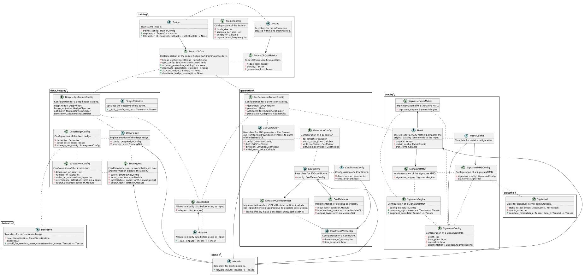

# Adversarial Robust Deep Hedging

## Objective

This repository solves problems of the type:

Maximize

$$
\inf_{P}R\Big(\sum_{n = 0}^{N-1} \phi_{t_n} \Delta S_{t_{n+1}}^P - C_{t_N}\Big) + \alpha(P)
$$

where 

- $P$ is a measure implying the dynamics of 
- a stock $S$ that
- can be traded on times $t_0, ..., t_{N-1}$ 
- with the strategy $\phi_{t_n}$ over the increment $\Delta S_{t_{n+1}} := S_{t_{n+1}} - S_{t_n}$ for all $n \in \lbrace 0, ..., N-1\rbrace$ to
- replicate an option with terminal payoff $C_{t_N}$

This should then maximize

- a utility functional $R$, which is
- penalized by $\alpha(P$), a penalty which is necessarily characterized as the function of the Sig-Wasserstein-distance of $P$ to some reference measure $Q$.

## Structure

The repository contains three core modules,

 - `generation`
 - `deep_hedging`
 - `penalty`

mimicking the three tasks that are united to solve problems as outlined above. 

Another module, `gan` focuses on the interplay of the three mentioned modules and provides the machinery for training
procedures.

An overview of the architecture provided in the `Structure.puml`, which yields:
